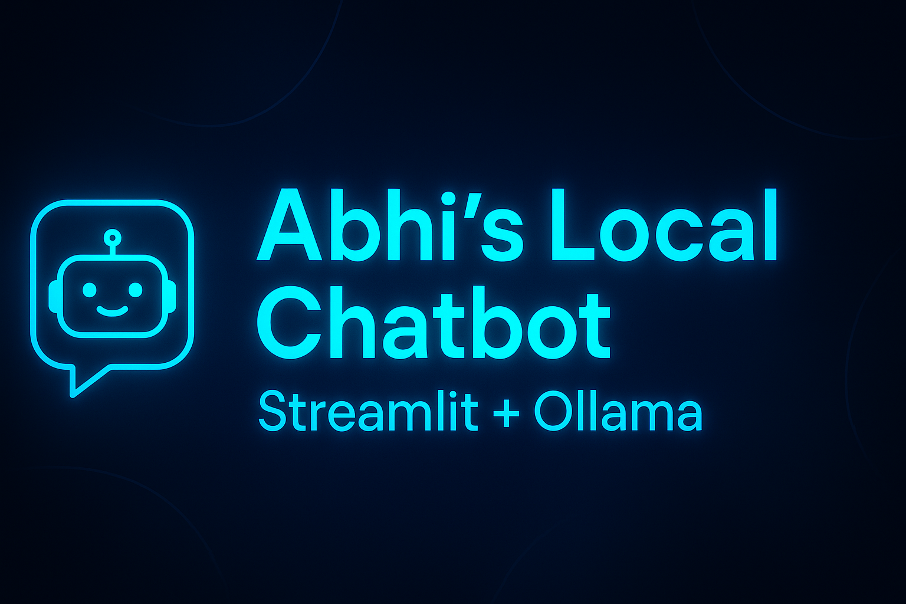

<p align="center">
  
</p>

<p align="center">
  
  
  
  
</p>


# 🤖 Abhi's Local Chatbot (Streamlit + Ollama)

A simple **ChatGPT-style chatbot** that runs 100% locally on your computer using **Streamlit** for the UI and **Ollama** for the AI model.

---

## 🧩 Features

✅ Runs completely offline using Ollama  
✅ Built with Streamlit (modern web UI)  
✅ Chat history memory  
✅ Stylish dark theme & glowing title  
✅ Works with local LLMs like `gemma3:1b`  

---

## 🚀 Getting Started

### 1️⃣ Install Requirements
```bash
pip install -r requirements.txt


